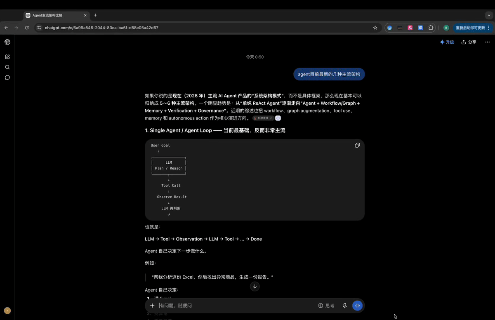

# ◎ CiteLens

**AI answers cite sources as tiny numbered links. CiteLens turns them into proof you can see.**

A Chrome extension that works natively on chatgpt.com: open any cited source *beside* the
answer, and let AI walk you — passage by passage, painted onto the live page — through **how
the source leads to the claim**.



▶ [高清视频版 (mp4)](docs/demo.mp4)

## The problem

A citation tells you a source *exists* — not which passage the claim came from, or how that
passage leads to the claim. Between "the AI said X" and "the source says Y" there is a
**derivation gap** that readers are left to close themselves: open the link, skim the whole
page, guess which paragraph the model meant, reconstruct the reasoning. Nobody does this.

CiteLens closes that gap for you, built around one metric: *time-to-verify* — how fast you go
from reading a claim to understanding exactly what it stands on.

## How it works

1. **◎ next to every citation.** In any ChatGPT answer, each cited link gets a ◎ button.
2. **The real page, split-screen.** Click it and the original source opens in Chrome's side
   panel — full layout, not a stripped-down reader view.
3. **One click: "Analyze".** Not a yes/no fact-check — a fast LLM call that closes the
   derivation gap:
   - **2–5 verbatim evidence quotes**, each tagged with a role that fits the article's genre
     (原理 / 推导 / 结论 / 数据 / 示例 / 条件 …) — one glance tells you which passage is the
     principle, which the data, which the conclusion
   - a short **reasoning chain** explaining how those passages add up to the claim
   - a summary verdict (✅ supported / ⚠️ partial — e.g. the source says "most cases" but the
     answer says "all" / ❌ not supported). With frontier models most claims do check out —
     the verdict is a quick signal; *seeing why* is the product.
4. **Evidence painted onto the page.** Each quote is highlighted sentence-precisely in its
   role color, with a collapsible "why this passage matters" note under the paragraph.
   Role chips in the panel jump straight to their passage.

**Annotations can't hallucinate.** Every quote is validated as an exact substring of the
page's rendered text before anything is drawn — if the model paraphrases, the quote is
discarded, and the panel reports how many evidence items were actually located.

## Install

```
chrome://extensions → Developer mode → Load unpacked → select extension/
```

Then open any ChatGPT answer with citations and click a ◎. "Analyze" needs an Anthropic API
key (⚙ in the panel) — stored only in your browser, used only when you click, ~$0.01 per
analysis. Chrome Web Store listing: coming soon.

## Why this product (the PM angle)

| Camp | Examples | What's missing |
| --- | --- | --- |
| RAG "chat with your docs" | NotebookLM, Kotaemon, RAGFlow | Great in-doc citations — but only inside their own chat, for your own files |
| AI chat with web citations | ChatGPT, Perplexity | Citations are links, not passages — verification is still manual |

CiteLens sits in the unclaimed middle: it doesn't replace your AI chat, it **overlays
verification onto the one you already use**. Zero migration cost is the distribution thesis.

## Also in this repo: the web playground

`/` (Next.js app) is a companion prototype exploring the *ideal* form of the same idea with
the [Anthropic Citations API](https://platform.claude.com/docs/en/build-with-claude/citations):
bring your own sources, ask a question, and get a split view where every sentence links
bidirectionally to the exact passage it cites — with character-level precision, because cited
text is extracted by the API rather than generated. Includes a zero-key demo mode.

```bash
npm install && npm run dev   # optional: ANTHROPIC_API_KEY in .env.local
```

The pair tells one story: the web app shows what citation UX looks like when you control the
whole pipeline; the extension shows how much of it you can retrofit onto products you don't.

## Roadmap

- Whole-answer overview: verify every citation in one pass ("7 citations: 5✅ 1⚠️ 1❌")
- Select any text in the answer → verify it, beyond citation granularity
- claude.ai adapter (the ChatGPT adapter is ~50 lines; selectors are config)
- Exportable verification reports; multi-model "citation diff"

## Stack

Chrome MV3 (zero build step) · Side Panel + declarativeNetRequest + CSS Custom Highlight API ·
Claude Haiku for analysis · Next.js + Tailwind + Citations API (web) · Readability for extraction

## Privacy

No backend, no data collection. Your API key lives in `chrome.storage.local`; page text goes
only to the Anthropic API, only when you click Analyze. Full policy: [PRIVACY.md](PRIVACY.md)
